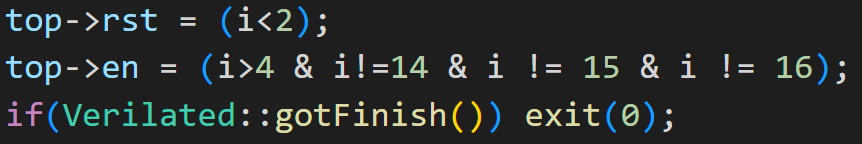
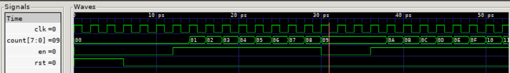
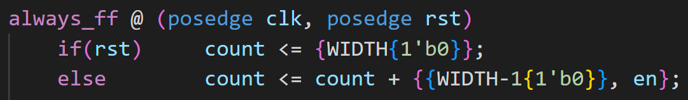
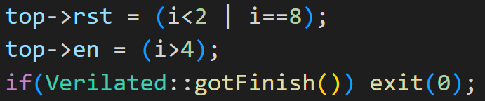
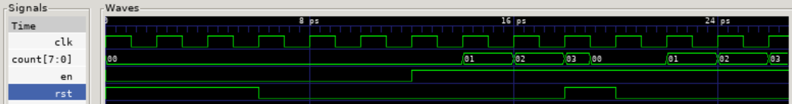

# Task 1
## Steps 1 and 2
- Forked the github repo to my own github account
- Cloned the repo to my device using Linux Terminal
- Opened the folder in VS Code
- pretty straight forward nothing special to note.

## Step 3
If reset is high, coutner value is set to 1 bit of 0 on the next cycle. Else count is incremented by 1 if enabler is high and extended to 8 bits with 0's on the next cycle.

## Step 4
Test bench created.

## Step 5
Created and authorised doit shell.

## Step 6
1 clk change = 1 ps
Note: eval comes before the enable or resets therefore it is delayed by 1 cycle if we say 0 is the first cycle.

## Test Yourself Challenge 
### 1 - Modify the testbench so that you stop counting for 3 cycles once the counter reaches 0x9, and then resume counting. You may also need to change the stimulus for rst.

Variable i denotes the clock cycle.

We first note the counter is not incrementing when i is 0 and 1 since the reset is active. On cycle 2 and 3 enable is not high so no addition is happening. Therefore additon starts when i = 4. Thus counter will reach 0x9 when i = 13.

To pause, we simply turn enable off for i = 14, 15, 16. Reset is also removed when i = 15.

As seen, the counter reaches 0x9 when i=13, then pauses 3 extra cycles.

### 2 - The current counter has a synchronous reset. To implement asynchronous reset, you can change line 11 of counter.sv to detect change in rst signal. (See notes.)

Definiton: A synchronous reset activates on the active clock edge when the reset signal is asserted. An asynchronous reset activates as soon as the reset signal is asserted.

Adding posedge rst makes reset asynchronous because the component is now updated as soon as reset occurs instead of being updated every positive clock cycle.

Set reset when i = 8 to test. 

Resultant waveform meets expectations as the reset occurs directly after without needing to wait for a positive clock edge.
