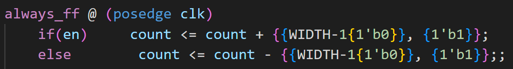

# Task 2
### Note - Issues when connecting to port
1. Need to give Linux shell access  to port (sudo chmod -R 777 /dev/ttyS5)
2. Need to include usleep(100000) in ack() and vdbflag() functions in vbuddy.cpp file. WSL messes up with data transfer in USBs.

## Steps 1 2 3
Just following instructions. Pretty simple. Counter counts up and graph works as expected.

## Test Yourself Challenge
### Modify your counter and testbench files so that the en signal controls the direction of counting: ‘1’ for up and ‘0’ for down, via the vbdFlag() function.

First I changed the counter_tb.cpp file to include ` top->en = vbdFlag();`, where `vbdflag()` returns a boolean value of the position of the flag.

Then in the counter.sv file, if en = 1 then the counter increments, else the counter is decrementing. The logic is shown in the code below.

This works as expected on the delay screen. Note when count reaches 0, it starts counting down from max value and vice versa.