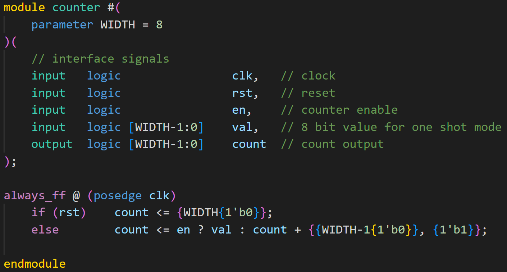
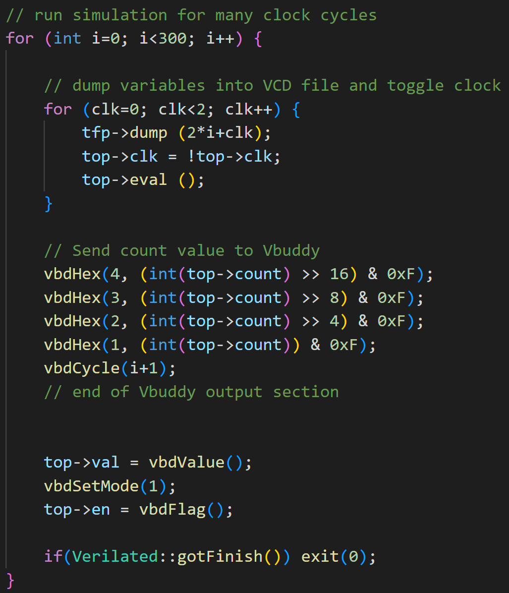
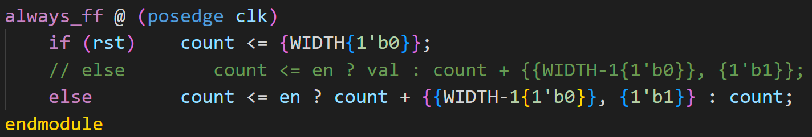

# Task 3
## Step 1 - Loadable counter

Goal is to force the counter to pre-set to Vbuddy's parameter value when pressing the switch on EC11, otherwise it increments by 1 every clk cycle.

We can simply utilise an multiplexer to select between the value of the one shot value and the normal increment value. The flag value which corresponds to the en value will decide on which value to output. 

The syntax of a multiplexer:
`Selector ? d1 : do`

Note: We have an extra input logic with a width of 8 bits which will be equal to the one-shot value.

For the test bench, we use the numpad to check the counter is 1-shot correctly. The flag value and the value of the rotary encoder is passed into the counter.

Note on new function: 
vbdSetMode(1): Whenever rotary encoder button is pressed, flag register is set 1 and then immediately reset to '0'.

## Step 2 - Single stepping

Goal is to increment the counter by 1 every time the rotary encoder switch is pressed.

The testbench does not need to be changed. We simply change counter.sv file, so that the multiplexer selects between the current value, and the current value + 1. Since `en = vbdFlag()`, en will be 0 unless the switch is pressed.

