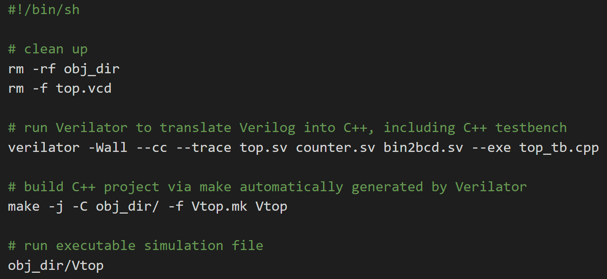

# Task 4
## Displaying count as Binary Coded Decimal (BCD) numbers

1. Create testbench file
- intialise top
- input signals at the correct time
- display output signals

2. Modify Top.sv
For specific changes, refer to `top_tb.cpp` file. Main changes are just renaming things such as Vcounter to Vtop.

3. Modify doit.sh

Plain name changes of files and inclusion of the extra .sv files

### Works according to expectation: increments by 1 and shows BCD numbers